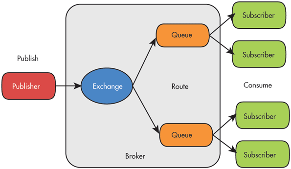

Тестовое задание Nota
=====================

Задание 2
---------
>Нарисовать схему и описать алгоритм реализации EventBus на Rabbitmq. Описать библиотеки, которые можно будет использовать в php для реализации паттерна. В каких фреймворках используется подоюное повоедение и как. Простые примеры заданий, в которых полезно использовать этот паттерн.

Решение
-------
В RabbitMQ реализована система обмена сообщениями по протоколу AMQP.
Основными участниками системы AMQP являются producer - отправитель сообщений, consumer - получатель (обработчик) сообщения, broker - посредник собирающий сообщения и распределяющий их по обработчикам.
В RabbitMQ брокер имеет следующую структуру - входящие сообщения обрабатываются в блоке exchange и распределяются по очередям (queue) в соответствии с заданными правилами (routing).
Обработчики (consumer) берут из очередей сообщения и обрабатывают их, взятые сообщения удаляются из очереди.

