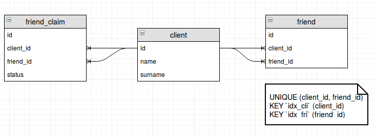

Тестовое задание Nota
=====================
Задание 3
------
>Реализовать в виде схем таблиц и sql запросов в Mysql функционал друзей:
    - пользователь №1 может отправить заявку на добавление пользователя №2 в друзья
    - пользователь №2 может принять или отклонить заявку
    - если пользователь №2 принял заявку - они становятся друзьями
Необходимо так же описать sql запрос на получение списка всех возможных друзей 2го круга (друзья друзей) для пользователя №1. Решение должно использовать минимальное количество таблиц и уметь работать с большими объемами данных (до 1000 друзей на пользователя, не менее 10000 пользователей в системе).

Решение
-------

Схема БД


```sql
-- Таблица заявок. 
CREATE TABLE `friends_claim` (
  `id` int(11) NOT NULL AUTO_INCREMENT,
  `client_id` int(11) NOT NULL,
  `friend_id` int(11) NOT NULL,
  `status` ENUM('new', 'accepted', 'declined'),
  PRIMARY KEY (`id`),
  UNIQUE (`client_id`,`friend_id`)
) ENGINE=InnoDB AUTO_INCREMENT=1;

-- Друзья
CREATE TABLE `friend` (
  `id` int(11) NOT NULL AUTO_INCREMENT,
  `client_id` int(11) NOT NULL,
  `friend_id` int(11) NOT NULL,
  PRIMARY KEY (`id`),
  UNIQUE (`client_id`, `friend_id`),
  KEY `idx_cli` (`client_id`),
  KEY `idx_fri` (`friend_id`)
) ENGINE=InnoDB AUTO_INCREMENT=1;

```

Добавление заявки
```sql
INSERT INTO friends_claim VALUES (cid, fid, 'new');
```

Отклонение заявки
```sql
UPDATE 
    friends_claim 
SET 
    status='declined' 
WHERE 
    client_id=cid AND friend_id=fid;
```

Принятие заявки
```sql
UPDATE 
    friends_claim 
SET 
    status='accepted' 
WHERE 
    (client_id=cid AND friend_id=fid) 
    OR 
    (client_id=fid AND friend_id=cid);
    
INSERT INTO
    friend (client_id, friend_id) 
VALUES 
    (MIN(cid, fid), MAX(cid, fid));
```


Друзья друзей
```sql
SELECT DISTINCT 
	f.friend_id 
FROM 
	friend f 
	JOIN friend ff 
		ON (f.client_id = 377 AND f.client_id = ff.friend_id);
```

